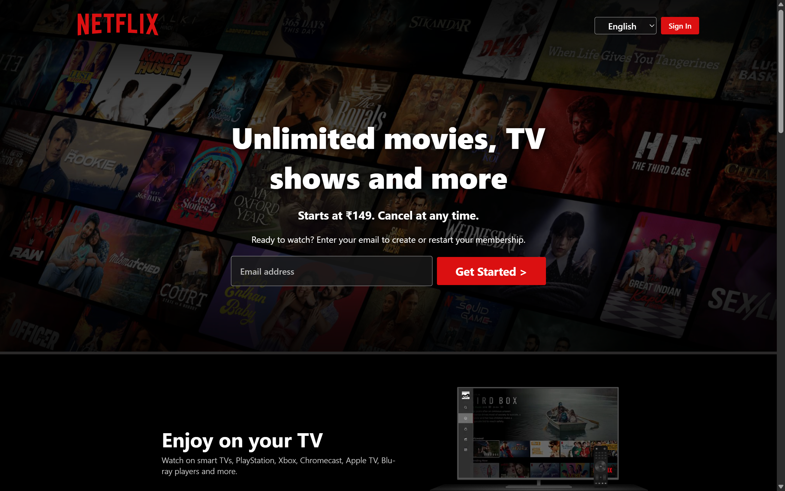

# Netflix Clone 🎬

A simple **Netflix homepage clone** built using **HTML & CSS**.  
This project is my first step towards web development, focusing on practicing layouts, responsiveness, and styling.

---

## 🚀 Demo
👉 [Live Demo on Vercel](https://demo-stream-project-yash.vercel.app/) 

---

## 📸 Preview
  

---

## 🔨 Features
- Netflix-inspired homepage UI  
- Responsive design (works on desktop & mobile)  
- Navigation bar, hero section, and movie categories  
- Clean and simple HTML & CSS structure  

---

## 🛠️ Tech Stack
- **HTML5**  
- **CSS3**

---

## 📚 Learning Goals
- Practiced HTML & CSS layouts
- Improved understanding of responsive design
- Learned to use Git & GitHub for project hosting

---

## 👨‍💻 Author 

**Yash Patel**
 

  

